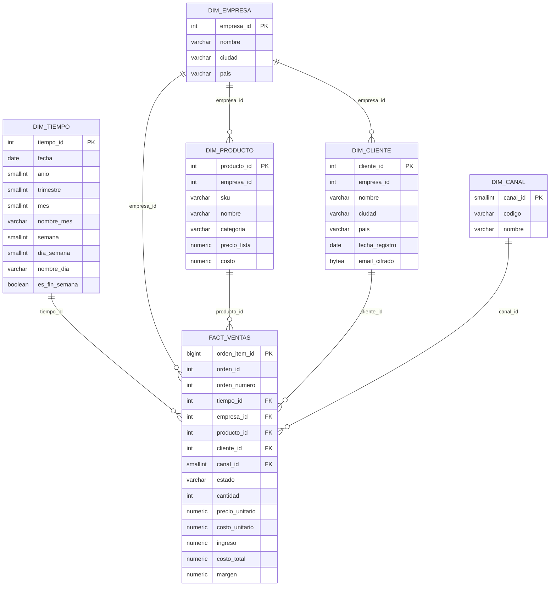

# 1. Diseno conceptual y logico de la bodega de datos

## 1.1 Necesidades de analisis

NovaCommerce es una plataforma multiempresa. Cada empresa (tenant) vende por dos canales: tienda en linea y venta directa (POS). Las preguntas de negocio que debe responder la bodega son:

- Cuanto se vende, con que margen, por mes, trimestre, dia de la semana, categoria, producto, canal y empresa.
- Que productos y categorias concentran el ingreso (Pareto / clasificacion ABC).
- Como se comportan los clientes (recencia, frecuencia y monto, RFM).
- Cual es la tasa de cancelacion por empresa y canal.
- Como evoluciona el ingreso frente al periodo anterior (comparaciones con funciones de ventana).

## 1.2 Modelo conceptual

Proceso de negocio: **venta** (linea de orden). Entidades y relaciones:

- Una Empresa tiene muchos Productos y muchos Clientes.
- Una Orden pertenece a una Empresa, la realiza un Cliente (opcional en venta directa), se hace por un Canal y ocurre en una Fecha.
- Una Orden tiene muchas Lineas; cada Linea corresponde a un Producto.

Medidas: cantidad, precio unitario, costo unitario, ingreso, costo total, margen.

## 1.3 Modelo logico: esquema en estrella

Tabla de hechos con granularidad de **una fila por linea de orden** (`dw.fact_ventas`) y cinco dimensiones conformadas.

Tablas de soporte: `dw.etl_control` (marca de agua), `dw.etl_ejecuciones` (bitacora de cargas) y `dw.audit_log` (auditoria).

### Aditividad de las medidas

| Medida | Tipo | Nota |
|---|---|---|
| cantidad, ingreso, costo_total, margen | Aditivas | Se pueden sumar por cualquier dimension |
| precio_unitario, costo_unitario | No aditivas | Se promedian o se ponderan por cantidad |

### Dimensiones lentamente cambiantes

- `dim_producto` y `dim_cliente` usan **SCD Tipo 2**: llave sustituta (`producto_sk`, `cliente_sk`), llave natural (`producto_id`, `cliente_id`), `fecha_inicio`, `fecha_fin` (nula en la version vigente) y `vigente`. Un cambio en nombre, categoria, precio de lista o costo (producto) o en nombre, ciudad o pais (cliente) cierra la version anterior y abre una nueva. Los hechos guardan la llave sustituta vigente en la fecha de la venta.
- `dim_empresa` usa **Tipo 1** (sobrescritura); `empresa_id` es la dimension conforme compartida por todos los hechos y la clave de aislamiento entre empresas.
- Segunda tabla de hechos: `dw.fact_inventario_snapshot`, snapshot periodico diario (una fila por producto y dia) con existencias, punto de reorden, stock de seguridad y EOQ. Comparte `dim_tiempo`, `dim_empresa` y `dim_producto` con ventas (matriz de bus en la documentacion final).

## 1.4 Justificacion: estrella frente a copo de nieve

| Criterio | Estrella (elegida) | Copo de nieve |
|---|---|---|
| Joins por consulta | Un nivel | Varios niveles |
| Rendimiento OLAP | Mejor | Peor por joins adicionales |
| Legibilidad para usuarios BI | Alta | Media |
| Redundancia | Baja en este caso: la unica jerarquia relevante es categoria (una columna de texto) | Normalizarla ahorra poco |
| Herramientas BI | Se modelan directamente | Requieren mas relaciones |

La jerarquia de producto tiene solo un nivel (categoria), por lo que normalizarla en otra tabla agregaria un join sin ahorro real. La jerarquia temporal (anio, trimestre, mes, semana, dia) se materializa en `dim_tiempo`, lo que evita funciones de fecha en cada consulta.

## 1.5 Consultas OLAP soportadas

- `ROLLUP` por empresa, categoria y producto (subtotales y total general).
- Funciones de ventana: `LAG` para variacion mes a mes, `RANK` para top de productos, `NTILE` para segmentos RFM, acumulados para curva ABC.
- Vistas listas para BI descritas en `05_integracion_bi.md`.

## 1.6 Reglas de carga del modelo

- Los hechos cancelados se conservan con `estado = 'cancelled'` y las vistas de analisis los excluyen; asi se puede medir la cancelacion.
- `producto_id` y `cliente_id` admiten nulo (venta directa sin cliente, producto eliminado).
- Integridad referencial declarada con llaves foraneas hacia todas las dimensiones.
