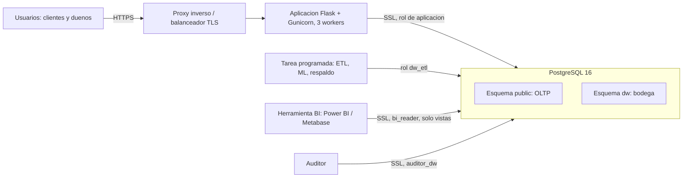

# 3. Modelo de despliegue de la infraestructura

## 3.1 Arquitectura logica

## 3.2 Componentes y dimensionamiento

| Componente | Funcion | Ambiente pruebas | Ambiente produccion (recomendado) |
|---|---|---|---|
| Aplicacion | Flask + Gunicorn | 1 proceso | 2 instancias, 3 workers cada una |
| Base de datos | PostgreSQL 16 | 1 instancia local | Instancia administrada, 2 vCPU, 8 GB RAM, 100 GB SSD, replica de lectura opcional |
| Proxy | TLS y cabeceras | No aplica | Nginx o balanceador del proveedor |
| Tareas | ETL incremental cada hora, ML diario, respaldo diario | Manual por CLI | Planificador del proveedor o cron |
| BI | Reportes | Metabase por Docker | Metabase o Power BI con puerta de enlace |

Volumen actual de la bodega: 72.078 hechos y 67 MB en total; el crecimiento esperado es lineal con las ventas, por lo que 100 GB cubren varios anos.

## 3.3 Ambientes

| Ambiente | Base | Datos | Proposito |
|---|---|---|---|
| Desarrollo | `novacommerce` local | Sinteticos (`seed-demo`) | Construccion y demostracion |
| Pruebas | `novacommerce_test` | Creados por cada prueba | 55 pruebas automaticas |
| Produccion | Instancia administrada | Reales | Operacion |

## 3.4 Red y seguridad de la infraestructura

- La base de datos no se expone a internet: solo acepta conexiones desde la red privada de la aplicacion, el planificador y el servidor BI.
- `sslmode=require` en todas las cadenas de conexion.
- Secretos (`SECRET_KEY`, `DW_ENCRYPTION_KEY`, contrasenas) en variables de entorno del proveedor; la aplicacion no arranca en produccion sin ellos.
- Cifrado de volumen para la base y los respaldos.
- Cabeceras de seguridad y CSP desde la aplicacion; `ProxyFix` segun `PROXY_COUNT`.

## 3.5 Escalabilidad y disponibilidad

- Aplicacion sin estado: se escala agregando instancias.
- Lecturas de BI a una replica para no competir con la operacion.
- Particionado de `fact_ventas` por rango de fecha cuando supere decenas de millones de filas.
- Respaldo diario y archivado de WAL; objetivo de recuperacion de 1 hora.

## 3.6 Procedimiento de despliegue

1. Aprovisionar PostgreSQL con SSL y crear la base.
2. Como superusuario: `psql -v bi_password=... -v auditor_password=... -f warehouse/roles.sql`.
3. Definir variables de entorno (`.env.example`).
4. `flask --app wsgi init-db` crea tablas operativas y el esquema `dw`.
5. `flask --app wsgi etl --full` carga la bodega.
6. `flask --app wsgi dw-verify` valida la carga.
7. Iniciar Gunicorn (`Procfile`).
8. Programar `etl` cada hora, `ml-run` diario y `dw-dump` diario.
